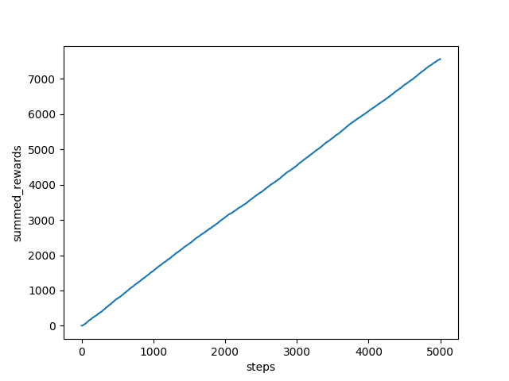

# Task 4  

For the k-bandits we tried the following approaches. First we tested random actions as a baseline this resulted in a mean score of 2228 and median score of 2207 (tested with 30 seeds). The next approach was to explore for a fixed amount of iterations and exploit in all other iterations. On the same 30 seeds with 1000 exploration steps this approach yielded a mean score of 6668 an a median score of 6646. In the submitted approach we have to trade-off Exploitation vs Exploration. For that we consider the expected best (action) value and  the remaining iterations. We would like to explore early and exploit later in the episode. Since all bandits are Gaussian, we estimate the Gaussian parameter μ using the MLE (sample mean). Our final solution uses a 'probability_to_explore' which decreases over time depending on the #of iterations as seen in the picture below. We archived a mean score of 7841 and a median score of 7795 with the same 30 seeds. 

Figure 1 shows the probability to explore over the number of iterations

.png) 

Figure 2 shows the summed reward over the number of iterations

